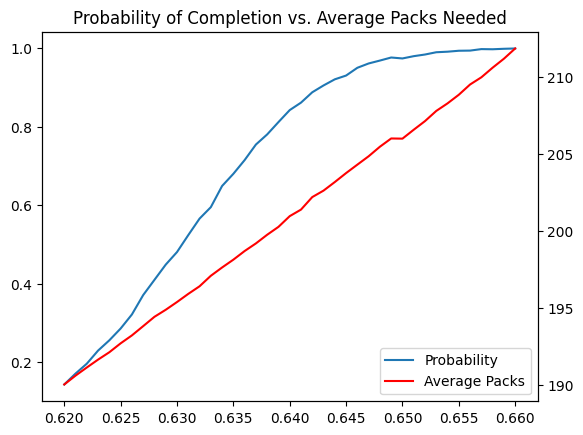
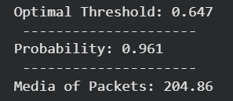

# When Should You Stop Buying Sticker Packs?

A Monte Carlo simulation inspired by the FIFA World Cup sticker album.

## Project Overview

Collecting stickers for a World Cup album becomes increasingly difficult as the album fills up. Early on, most stickers are new, but later purchases tend to produce duplicates.

This project explores a simple question:

> At what point does it become more efficient to trade duplicate stickers rather than continue buying packs?

To answer this, I modeled the problem using Monte Carlo simulation and concepts from the Coupon Collector Problem.

---

## Assumptions

The model assumes:

- 980 unique stickers in the album.
- Each pack contains 5 random stickers.
- All stickers are equally likely to appear.
- Duplicate stickers can be exchanged on a 1:1 basis.
- Trading is assumed to be perfect (any duplicate can be exchanged for any missing sticker).

---

## Methodology

For each simulation:

1. Buy packs until a given completion threshold is reached.
2. Count the number of duplicate stickers accumulated.
3. Use duplicates to trade for missing stickers.
4. Check whether the album can be completed through trading alone.

This process is repeated thousands of times for different completion thresholds.

---

## Results

The simulation revealed a critical threshold around **64-65% album completion**.

Below this point, collectors typically do not accumulate enough duplicates to complete the album through trading.

Above this point, the probability of completing the album increases rapidly and approaches 100%.

### Probability of Completion vs Threshold

---

## Key Insight

Under the perfect trading assumption, reaching approximately **65% completion** appears sufficient to make trading a highly effective strategy.

This result illustrates an economic concept similar to **diminishing marginal returns**:

- Early purchases generate many new stickers.
- Later purchases generate mostly duplicates.
- Eventually, trading becomes more efficient than buying additional packs.

---

## Technologies Used

- Python
- NumPy
- Matplotlib
- Monte Carlo Simulation

---

## Future Improvements

Possible extensions include:

- Modeling rare and ultra-rare stickers.
- Simulating imperfect trading markets.
- Including direct purchase of missing stickers.
- Comparing different pack sizes.
- Estimating the total expected cost of album completion.

---

